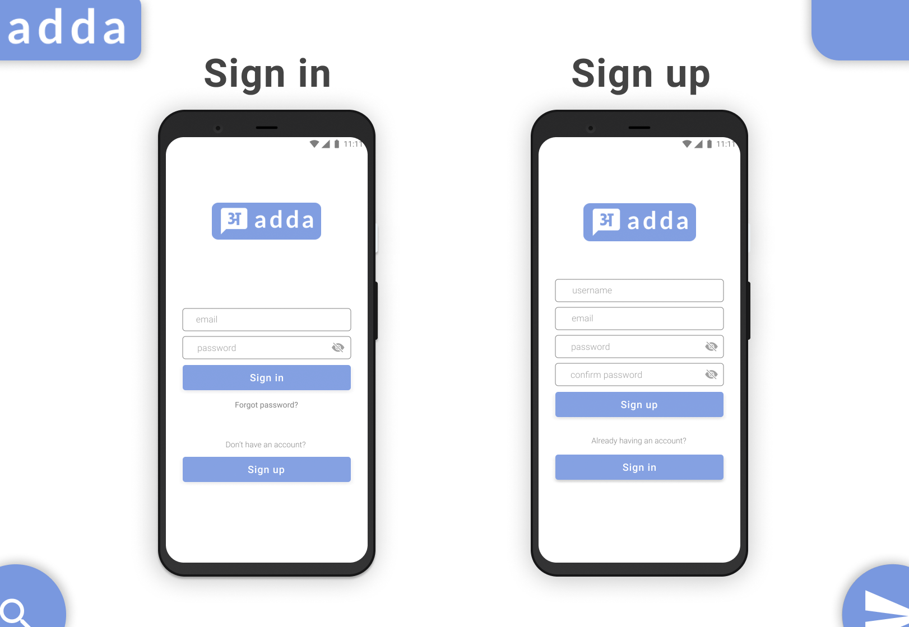
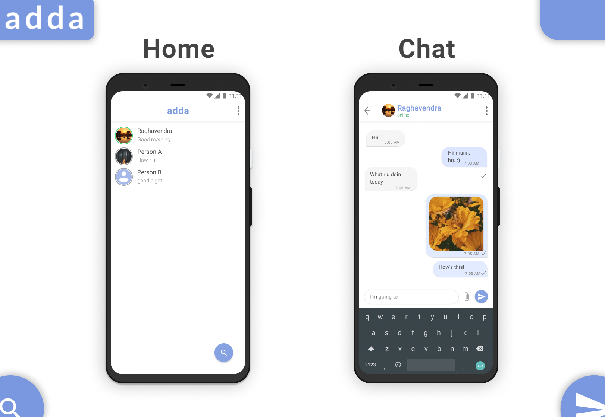

# adda

Adda is a mobile based application used for one to one communication.
 
It is developed using Google's Flutter framework, which is really a good tool for rapid development of cross platform apps, web apps.
 
For developing the app, I have implemented few of the good features which are currently being used by top chatting apps like WhatsApp and Telegram.

##### Technologies used to develop are:
1. Figma
2. Flutter
3. Firebase Functions
4. Firebase Storage
5. Firebase Cloud Firestore
6. Firebase Authentication

##### Languages used are:
1. Dart
2. Node.js

### Configure
- Setup keystore.properties if you are going to build a release version of the app. [This](https://flutter.dev/docs/deployment/android#create-a-keystore) will guide you to make one.
- If you want to setup your own Firebase database i.e adding google-services.json, [click here](http://alphatech.technology/Howto-Entry-srk/Google-Services-Json-bek/) for the docs.

### Screenshots

[Click here](assets/visual-mockups-v2.0) to view the visual mockup of the app.

### Demo

Check out demo video of the app [here](https://youtu.be/YeGTDmMumXE)
